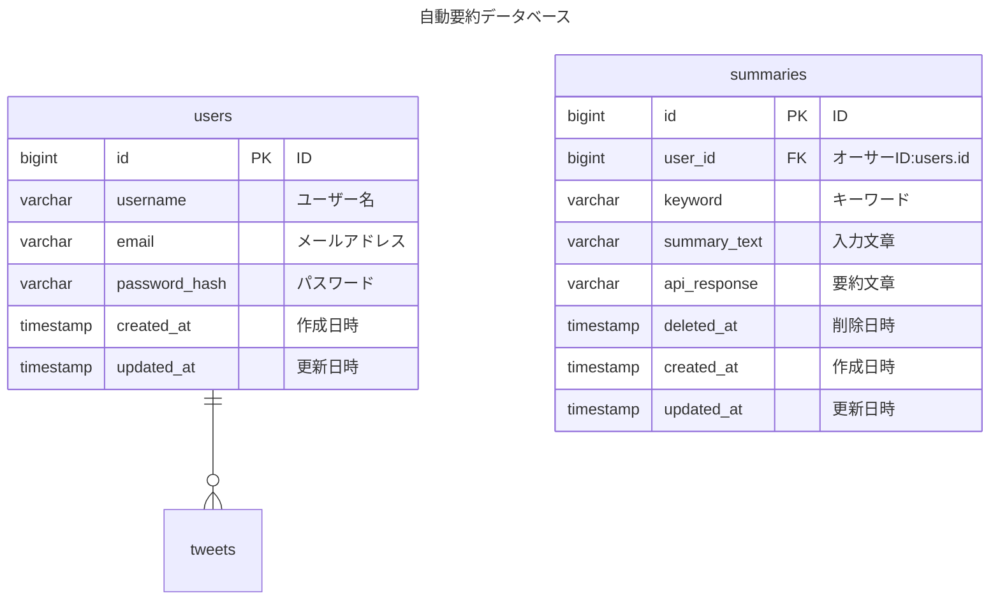

# ER 図

## tweet データベース

```mermaid
---
title: "自動要約データベース"
---
erDiagram
    users ||--o{ tweets : ""

    users {
        bigint id PK "ID"
        varchar username "ユーザー名"
        varchar email "メールアドレス"
        varchar password_hash  "パスワード"
        timestamp created_at "作成日時"
        timestamp updated_at "更新日時"
    }

    summaries {
        bigint id PK "ID"
        bigint user_id FK "オーサーID:users.id"
        varchar keyword "キーワード"
        varchar summary_text "入力文章"
        varchar api_response  "要約文章"
        timestamp deleted_at "削除日時"
        timestamp created_at "作成日時"
        timestamp updated_at "更新日時"
    }
```
